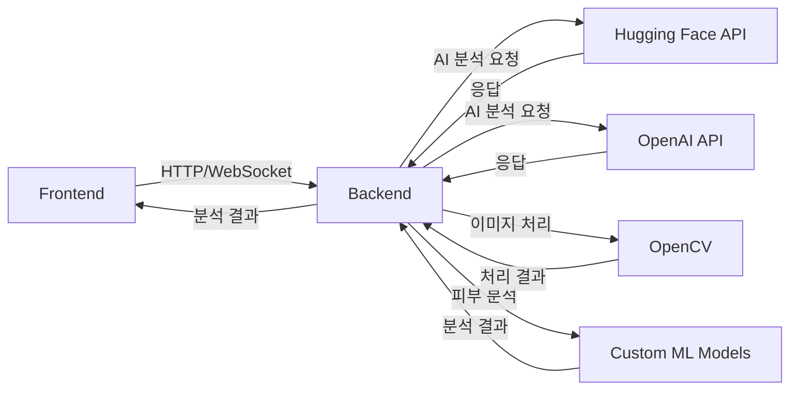

# AI 피부 분석기 2025 🎯

> 2025년 최신 AI 기술을 활용한 실시간 피부 분석 웹 애플리케이션

## 📚 목차
- [프로젝트 개요](#-프로젝트-개요)
- [주요 기능](#-주요-기능)
- [기술 스택](#-기술-스택)
- [시스템 아키텍처](#-시스템-아키텍처)
- [API 명세](#-api-명세)
- [AI 모델 상세](#-ai-모델-상세)
- [주요 함수 설명](#-주요-함수-설명)
- [설치 및 실행](#-설치-및-실행)
- [프로젝트 구조](#-프로젝트-구조)

## 🚀 프로젝트 개요

AI 기반 실시간 피부 분석 웹 애플리케이션으로, 사용자의 얼굴 사진을 분석하여 피부 타입, 수분도, 유분도, 잡티 등을 진단하고 개인 맞춤형 스킨케어 제품을 추천합니다.

## 💡 주요 기능

1. **실시간 얼굴 인식 및 촬영**
   - 웹캠을 통한 실시간 얼굴 감지
   - 자동 카운트다운 촬영
   - 가이드라인 UI 제공

2. **고급 피부 분석**
   - 6가지 주요 지표 분석
   - AI 기반 연령대 추정
   - 실시간 피부 상태 모니터링

3. **맞춤형 제품 추천**
   - 피부 타입별 제품 추천
   - 계절별 스킨케어 팁 제공
   - 개인화된 관리 방법 제안

## 🛠 기술 스택

### Backend
- **FastAPI**: 고성능 비동기 API 서버
- **OpenCV**: 이미지 처리 및 얼굴 감지
- **NumPy/SciPy**: 수치 연산 및 이미지 분석
- **Hugging Face Transformers**: AI 모델 통합
- **PyTorch**: 딥러닝 모델 실행

### Frontend
- **React 18**: UI 컴포넌트 및 상태 관리
- **TailwindCSS**: 반응형 디자인
- **Lucide React**: 모던 아이콘 시스템
- **WebRTC**: 실시간 카메라 스트리밍

## 🏗 시스템 아키텍처



## 📡 API 명세

### 1. 기본 엔드포인트
- **GET /** - API 정보 및 상태
- **GET /health** - 서버 상태 확인

### 2. 분석 엔드포인트
- **POST /analyze-skin-base64**
  ```json
  {
    "image": "base64_encoded_image_string"
  }
  ```
  응답:
  ```json
  {
    "success": true,
    "analysis_method": "2025년 최신 AI 기반 분석",
    "result": {
      "skin_type": "string",
      "moisture_level": 0-100,
      "oil_level": 0-100,
      "blemish_count": number,
      "skin_tone": "string",
      "wrinkle_level": 1-5,
      "age_range": "string",
      "confidence": 0.0-1.0
    }
  }
  ```

## 🤖 AI 모델 상세

### 1. 얼굴 감지 모델
- **YOLOv8n-face**: 실시간 얼굴 감지
- **OpenCV Cascade**: 백업 얼굴 감지 시스템

### 2. 피부 분석 모델
- **Face-Parsing Segformer**: 얼굴 영역 분할
- **ViT Age Classifier**: 연령대 분석
- **Custom Skin Analysis**: 피부 상태 분석

### 3. 텍스처 분석
- **Advanced CV Algorithm**: 주름/모공 분석
- **Color Analysis**: 피부톤 분석
- **Blemish Detection**: 잡티 감지

## 🔍 주요 함수 설명

### Backend

#### 1. ModernSkinAnalyzer 클래스
- `analyze_image(image)`: 메인 분석 파이프라인
- `detect_face(image)`: 얼굴 감지 처리
- `analyze_skin_advanced_2025(image, parsing_result)`: 피부 분석
- `analyze_age_2025(face_image)`: 연령대 분석

#### 2. 이미지 처리 함수
- `preprocess_image_2025(image)`: 이미지 전처리
- `enhanced_skin_detection(image)`: 고급 피부 감지
- `detect_blemishes_ai_2025(image, mask)`: 잡티 감지

### Frontend

#### 1. SkinAnalyzer2025 컴포넌트
- `checkFaceDetection()`: 실시간 얼굴 감지
- `capturePhoto()`: 고화질 사진 촬영
- `analyzeSkin()`: API 호출 및 결과 처리

#### 2. 카메라 관련 함수
- `startCamera()`: 웹캠 초기화
- `handleFileUpload()`: 이미지 업로드 처리
- `startCountDown()`: 자동 촬영 카운트다운

## 📦 설치 및 실행

### Backend 설정
```bash
cd backend
python -m venv venv
source venv/bin/activate  # Windows: venv\Scripts\activate
pip install -r requirements.txt
uvicorn main:app --reload
```

### Frontend 설정
```bash
cd frontend
npm install
npm start
```

## 📂 프로젝트 구조

```
miniproject/
├── backend/
│   ├── main.py              # FastAPI 서버
│   └── requirements.txt     # Python 의존성
├── frontend/
│   ├── src/
│   │   ├── components/      # React 컴포넌트
│   │   └── App.jsx         # 메인 앱
│   └── package.json        # Node.js 의존성
└── model/                  # AI 모델 파일
```

## 🔐 보안 및 최적화

1. **데이터 보안**
   - 이미지 데이터 즉시 삭제
   - CORS 보안 설정
   - API 요청 제한

2. **성능 최적화**
   - 이미지 압축 및 전처리
   - 비동기 처리
   - 캐시 시스템

## 👥 기여 방법

1. Fork the Project
2. Create your Feature Branch
3. Commit your Changes
4. Push to the Branch
5. Open a Pull Request

## 📄 라이선스

이 프로젝트는 MIT 라이선스로 배포됩니다.

---

## 🌟 버전 기록

- v3.0.0 (2025) - 최신 AI 모델 통합
- v2.0.0 (2024) - 실시간 분석 추가
- v1.0.0 (2023) - 초기 버전 출시
